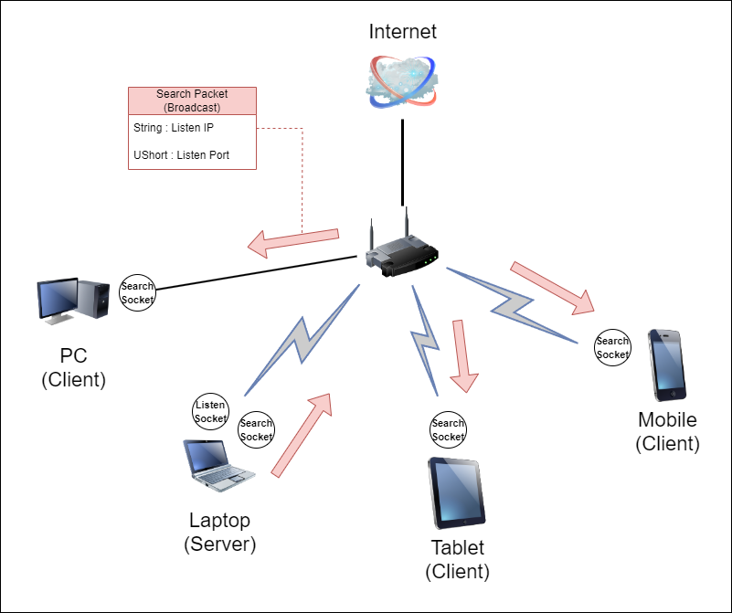
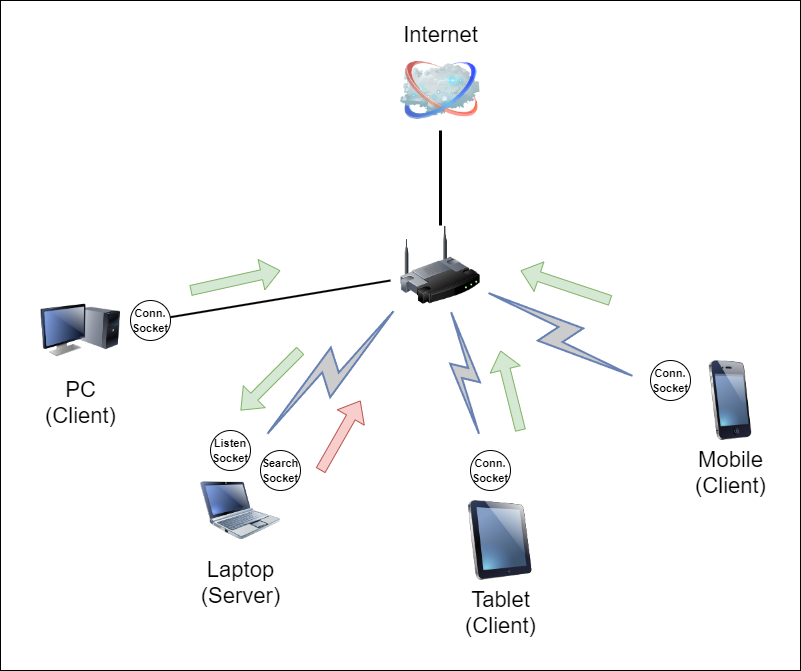

# LANMultiplayerModule

 

I'm now developing a Unity game using this project. 
https://github.com/sete3683/LANMultiplayerGomoku
  

## Introduce

LANMultiplayerModule was developed for LAN multiplayer game development. While this technology has become obsolete with the advancement of networks, it remains an attractive option for developers who do not wish to maintain servers. I hope this project will be helpful to others.
  

The advantage of LAN multiplayer is that it does not require a relay server. By using UDP broadcast message, it is easy to find other players. When the server broadcasts its endpoint data for the listening socket, clients who receive this message can easily connect to the server. Clients do not need to know the server's information in advance. They only need to know the socket required for broadcasting.
  

Once the client obtains the server's endpoint data from the broadcast message, it closes the search socket and switches to the connect socket to make a TCP connection with the server. Once the session is established, the server and client can perform user-defined actions with pre-defined packets. Of course, even after the session is established, the server can continue to search for clients.
  

## Caution

I have written this project in C# to apply it in Unity. However, certain features like Span may not be supported in older versions of C#. Therefore, if you are using an editor version below 2021.x, please be cautious when using it.
